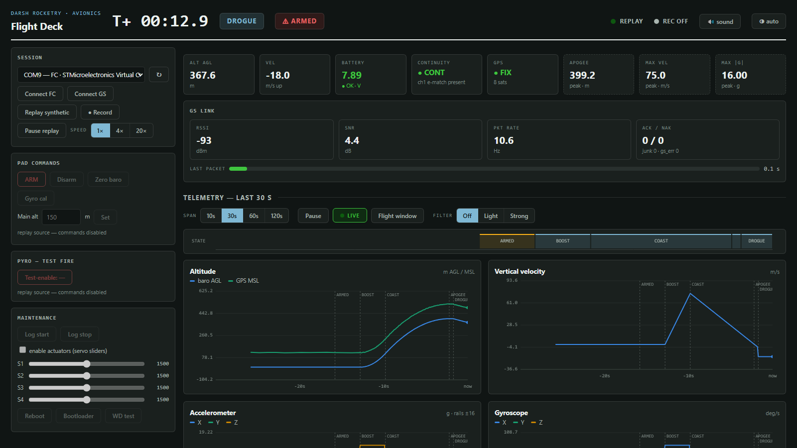

# Rocket Flight Controller

A custom, open-source flight computer for model and high-power rockets — STM32F722 (Cortex-M7) with onboard IMU, barometer, GPS, dual pyro channels, quad servo outputs, and microSD logging. Designed from scratch in KiCad.

## Why I built it

Wanted to get my feet wet with more mixed PCB design. I designed this as a base for firmware and testing I plan to designing another one after I build and test this one on actual rockets. I plan to use this for my rocketry team for active control and data logging 

## Use cases

- **Dual-deploy recovery** — fire a drogue at apogee and main at a set altitude using the two pyro channels.
- **Active stabilization** — drive the four servo outputs for thrust-vector control or canard/fin steering during boost.
- **Flight data logging** — log IMU, barometer, and GPS to microSD for post-flight analysis (apogee, max velocity, flight path).
- **GPS tracking** — downrange tracking and finding the rocket after landing.
- **Telemetry** — optional LoRa (SX1262, 915 MHz) expansion for live altitude/position downlink.
- **General avionics dev board** — the IMU + baro + GPS + servo + logging combo also works for drones, RC, robotics, or balloon payloads.

## Specifications

| Subsystem | Part / detail |
|---|---|
| MCU | STM32F722RET6 — Cortex-M7, up to 216 MHz |
| IMU | ISM330DHCX — 6-axis accel (±16 g) + gyro, SPI (built rev; early docs said ICM-45686) |
| Barometer | BMP580 — altitude / apogee detection (I²C) |
| Storage | microSD (SDMMC1, 4-bit) — 200 Hz binary flight log |
| Recovery | pyro channels — 2 designed, 1 routed on this rev (gate PB13, continuity sense) |
| Control | 4× servo outputs (TIM2) — TVC / fin / canard |
| GPS | NMEA module on USART6, JST-GH + PRTR5V0U2X ESD protection |
| Telemetry | LoRa Wio-SX1262 (915 MHz, TCXO) — live downlink verified on hardware |
| Power | 2S LiPo, BQ25883 charger, USB-C |
| Status | WS2812 RGB status LED |

## Bench status (July 2026)

All subsystems green on hardware: IMU, barometer, SD logging, LoRa radio
(TCXO confirmed, telemetry transmitting), charger, GPS UART. Firmware is
hardened for flight: IWDG watchdog with reset-cause logging, Kalman
altitude filter with outlier gating, pad-drift baro tracking, flash-persisted
main-deploy altitude, 64 KB log ring, interlocked pad-only test-fire, and a
full host-side test suite. Remaining before flight: ground-station pin map +
build, threshold tuning to the motor/airframe, and a healthier USB cable.

## BOM

| Name | Purpose | Qty | Unit Cost (USD) | Line Cost (USD) | Link | Distributor | Notes |
|---|---|---|---|---|---|---|---|
| 1uF | Decoupling cap (0603, X7R, 25V) | 4 | $0.02 | $0.08 | Link | Digikey | |
| 10uF | Bulk decoupling (0805, X5R, 16V) | 7 | $0.10 | $0.40 | Link | Digikey | |
| 47nF | Filter cap, possibly BQ25883 ILIM or feedback (0603) | 1 | $0.02 | $0.02 | Link | Digikey | |
| 44uF | Unusual value — check schematic | 1 | $0.50 | $0.50 | Link | Digikey |  |
| 10uF | Bulk decoupling (0805, X5R) | 2 | $0.10 | $0.20 | Link | Digikey | |
| 22uF | Switching regulator output cap (0805, X5R, 16V) | 3 | $0.20 | $0.60 | Link | Digikey | |
| 100nF | Generic decoupling, 0402 or 0603 X7R | 12 | $0.01 | $0.12 | Link | Digikey | |
| 2.2uF | STM32 VCAP_1 (PA0) capacitor — 2.2µF X7R 0603 | 1 | $0.05 | $0.05 | Link | Digikey | Critical for MCU core regulator stability |
| 22uF | Regulator input/output cap | 2 | $0.20 | $0.40 | Link | Digikey | |
| 2.2uF | Second VCAP or filter | 1 | $0.05 | $0.05 | Link | Digikey | |
| 20pF | HSE crystal load capacitor (matches X322525MOB4SI) | 2 | $0.05 | $0.10 | Link | Digikey | Value depends on crystal CL spec — verify |
| 6.8pF | LSE 32.768kHz crystal load capacitor | 2 | $0.05 | $0.10 | Link | Digikey | Adjust to match crystal CL = ~7pF |
| 100nF | Generic decoupling, 0402 or 0603 | 5 | $0.01 | $0.05 | Link | Digikey | |
| TF-01A | MicroSD card socket (push-pull or hinged) | 1 | $1.50 | $1.50 | Link | LCSC | LCSC-style part — Hirose DM3AT-SF-PEJM5 is a Digikey alternative |
| LED | Generic indicator LED 0603 (e.g., power indicator) | 1 | $0.10 | $0.10 | Link | Digikey | |
| WS2812B-2020 | Addressable RGB status LED, single-wire (KMK-style) | 1 | $0.30 | $0.30 | Link | LCSC | Cheaper on LCSC than Digikey |
| PRTR5V0U2X | Dual-line TVS ESD protection for GPS UART | 1 | $0.35 | $0.35 | Link | Digikey | Nexperia, SOT-143B |
| Screw_Terminal_01x02 | 2-pin screw terminal — pyro outputs and battery | 3 | $1.20 | $3.60 | Link | Digikey | |
| BM05B-GHS-TBT_LF__SN__N_ | JST-GH 5-pin top-entry connector (GPS, Pixhawk standard) | 1 | $0.55 | $0.55 | Link | Digikey | JST part #BM05B-GHS-TBT(LF)(SN)(N) |
| FCM1608KF-601T03 | Ferrite bead 600Ω @ 100MHz, 0603 — analog supply filter | 1 | $0.10 | $0.10 | Link | Digikey | Taiyo Yuden |
| DFE252012F-1R0M=P2 | Power inductor 1.0µH, 2520 case — buck output (LMR51430?) | 1 | $0.40 | $0.40 | Link | Digikey | Toko/Murata, ~3.6A saturation |
| XFL4020-152MEC | Power inductor 1.5µH, 4×4mm — switcher output | 1 | $1.50 | $1.50 | Link | Digikey | Coilcraft, very low DCR |
| YHNR3015-5R6M | Power inductor 5.6µH — likely buck-boost (TPS63070) | 1 | $0.30 | $0.30 | Link | LCSC | Sunlord, LCSC-stocked |
| AO3400A | N-channel logic-level MOSFET, SOT-23 — pyro low-side switch | 2 | $0.15 | $0.30 | Link | Digikey | |
| 5.1K Ohm | Pullup/divider — USB-C CC1/CC2 (5.1k for device-mode detect) | 2 | $0.01 | $0.02 | Link | Digikey | Required for USB-C device mode |
| .383k Ohm | Precision resistor — likely BQ25883 ISET or regulator FB | 1 | $0.10 | $0.10 | Link | Digikey | |
| 5.23K Ohm | Feedback divider for switching regulator | 1 | $0.05 | $0.05 | Link | Digikey | 1% precision |
| 30.1K Ohm | Feedback divider (top resistor) for switching regulator | 1 | $0.05 | $0.05 | Link | Digikey | 1% precision |
| 10K Ohm | Generic pullups/pulldowns, gate pulldowns on MOSFETs (0603) | 19 | $0.01 | $0.19 | Link | Digikey | Cheap in bulk |
| 100K Ohm | Continuity divider top (pyro sense) | 1 | $0.01 | $0.01 | Link | Digikey | |
| 22.1K Ohm | Precision feedback or current-set resistor | 1 | $0.05 | $0.05 | Link | Digikey | 1% precision |
| 100K Ohm | More continuity dividers | 2 | $0.01 | $0.02 | Link | Digikey | |
| 100 Ohm | Gate series resistors on pyro MOSFETs | 3 | $0.01 | $0.03 | Link | Digikey | |
| Conn_01x03 | 3-pin header — likely servo/PWM outputs or programming | 4 | $0.30 | $1.20 | Link | Digikey | (2.54mm standard) |
| TS-1088-AR02016 | Tactile switch — boot/reset buttons | 2 | $0.20 | $0.40 | Link | Digikey | Cheap SMD tactile, also on LCSC |
| STM32F722RETx | Main MCU — ARM Cortex-M7, 216MHz, 512KB flash | 1 | $10.50 | $10.50 | Link | Digikey/Mouser | Check stock — F7 series can be supply-constrained |
| BQ25883RGER | Single-cell Li-ion charger w/ I2C, up to 2A | 1 | $3.80 | $3.80 | Link | Digikey | TI, QFN-24 |
| ICM-45686 | 6-axis IMU (accel + gyro), low-noise, SPI | 1 | $12.00 | $12.00 | Link | Digikey | TDK InvenSense, LGA-14. Newer than ICM-42688-P |
| BMP580 | Barometric pressure / altitude sensor (high resolution) | 1 | $4.20 | $4.20 | Link | Digikey | Bosch Sensortec, replaces BMP388 |
| TPS63070RNMR | Buck-boost regulator, 2A, 2-16V in | 1 | $3.60 | $3.60 | Link | Digikey | TI, VQFN-15 |
| LMR51430 | Buck regulator, 3A, simple step-down | 1 | $1.40 | $1.40 | Link | Digikey | TI, SOT-23-6 family |
| TYPE-C 16PIN 2MD(073) | USB-C connector, 16-pin (USB 2.0 only) | 1 | $0.50 | $0.50 | Link | LCSC | LCSC-style part number. Alt: GCT USB4105-GF-A (Digikey) |
| X322525MOB4SI | HSE crystal 25MHz, SMD 3225 | 1 | $0.60 | $0.60 | Link | LCSC | Yangxing. Alt: Abracon ABM8G-25.000MHZ |
| Q13FC1350000400 | LSE crystal 32.768kHz (RTC) | 1 | $0.40 | $0.40 | Link | Digikey | Epson FC-135 |

## Firmware & software

The flight firmware and ground tools live in this repo:

| Where | What |
|---|---|
| [`flight-controller/`](flight-controller/) | STM32F722 flight firmware — sensors, Kalman altitude filter, flight state machine, pyro control (heavily interlocked), SD logging, LoRa telemetry, IWDG watchdog, USB console |
| [`ground-station/`](ground-station/) | RP2040 + SX1262 LoRa ground station (RadioLib sketch; pin map pending) |
| [`shared/`](shared/) | `protocol.h` — the single source of truth for the radio link + packet formats |
| [`tools/`](tools/) | **Flight Deck** ops dashboard, bring-up dashboard, serial monitor, log/telemetry decoders |
| [`tests/`](tests/) | 160+ host-side unit tests (`py -m unittest discover -s tests`) |
| [`docs/FIRMWARE.md`](docs/FIRMWARE.md) | build / flash / console / bench guide |
| [`docs/PINMAP.md`](docs/PINMAP.md) | authoritative pin map extracted from the KiCad netlist |

## This project uses:

- [KiCad](https://www.kicad.org/)
- [STM32CubeMX](https://www.st.com/en/development-tools/stm32cubemx.html)
- [easyeda2kicad.py](https://github.com/uPesy/easyeda2kicad.py)
- [Hack Club Blueprint](https://blueprint.hackclub.com/)
